<h1 allign="center" id="title"> Mani & Me </h1>

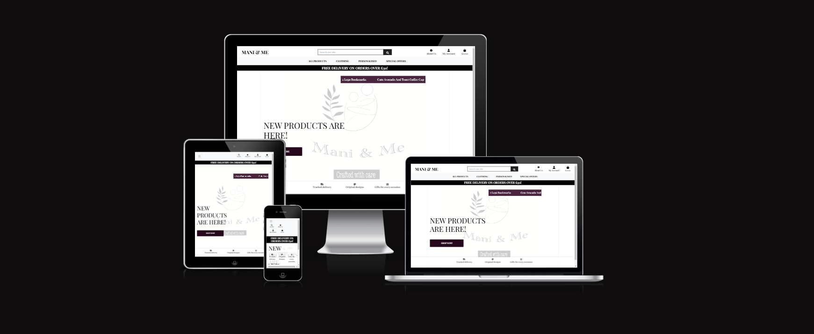

[Live Project can be viewed here.](https://mani-and-me-3a77440a82f2.herokuapp.com/)

Mani & Me is site that sells beautifully printed gifts for all. A heart-filled business that celebrates creativity, family, and the joy of personalisation.

## Table of Contents

### User Experience (UX)

- [Project Goals](#project-goals)
- [User Goals](#user-experience-ux)
- [Developer Goals](#developers-goals)
- [User Stories](#user-stories)
- [Design Choices](#design-choices)
- [Wireframes](#wireframes)

### Features

- [Current Features](#current-features)
- [Future Features](#future-features)

### Testing

- [Manual Testing](#manual-testing)
- [Bugs](#bugs)

### Deployment

- [How to Deploy Site](#deployments)

### Credits

- [Credits](#credits)
- [Code](#code)
- [Acknowledgments](#acknowledgments)

## User Experience (UX)

### Project Goals

This project's goal is to build a full-stack site that allows your users to browse and find products. As well as place orders and pay on the site. I would like to make this the base of the site that I will be gifting to a relative that has recently started up a small business.

#### User Goals:

- Easily find products via search or browsing the site.
- Able to add products to shopping bag.
- View my shopping bag context and the total.
- Ability to provide details for shipping.
- Contact information for the business.

#### Developers goals:

- Create a functional site for a relative who has started up a business recently.
- Demonstrate the use of full-stack development in its entirety.
- Make a site that allows users to find products and place orders.
- Make a compelling site that can be used by superusers and customers.

#### User Stories

As a user I want:

- To search for products.
- View individual product details
- Ability to view total of shopping at any moment.
- Able to filter products.
- Easilt create an account and login.
- Easy navigation.
- Able to place an order and pay online.
- Securely enter my payment information
- Receive an immediate order confirmation email with details of my purchase.
- Easily manage my account details including shipping addresses.
- Able to save items to a wishlist for future purchases.

As a returning customer:

- Access my saved shipping addresses to expedite checkout.
- I want to see my order history.

As the site owner I want:

- A site that provides search and share functions.
- A structured and PEP8 compliant.
- Easily add, edit and delete products on the online store.
- Manage product categories and subcategories to organize my store effectively, allowing customers to navigate easily
- Demonstrate what I have learnt with Python and external libiraries.
- A site that functions and is consistent with handling data. As well as accepts payments and send email confirmations.
- Navigation bar that alllows users to access different parts of the sites.
- Sign up, login and logout feature to allow a user to sign up. They can logout of the session when they are finished using the site.
- Dashboard, for users to view their past orders and edit/update shipping information.

## Design Choices

### Languages Used

- HTML
- CSS
- JavaScript
- Django
- Python

### Fonts

- Playfair Display was used through the site from google fonts.

### Icons

- Font Awesome has been used through out the project to provide easily identifiable icons to help users navigate through the site.
- Favicon was also use to create the tab icon for the browser. I had already had a previous logo so i had converted this via the favicon website to use.

### Colours

- Coolors was used to generate random colours that could be used in my site for buttons, background and borders.

### Images

- The images sourced have been taken by a relative, who will be gifted this site. They have created all of the products that are displayed on the site.
- All images and static files have been uploaded/managed by Amazon Web Services (AWS).

### Wireframes

Wireframes were created using [Balsamiq](https://balsamiq.com/).

- [Home](/readme/wireframes/homepage.png)
- [Products Page](/readme/wireframes/shop-products.png)
- [Product Info](/readme/wireframes/product-page.png)
- [Add to Bag](/readme/wireframes/product-page-add-to-bag.png)
- [Shopping Bag](/readme/wireframes/checkout.png)
- [Checkout Success](/readme/wireframes/checkout-success.png)
- [Checkout Complete Order](/readme/wireframes/checkout-complete-order.png)
- [Order History](/readme/wireframes/order-history-my-profile.png)
- [About Us](/readme/wireframes/about-us-page.png)
- [Contact Us](/readme/wireframes/contact-us-page.png)
- [Product Management](/readme/wireframes/product-management.png)
- [Inventory Management](/readme/wireframes/inventory-management.png)

## Features

### Current Features

The current features on the site are to ensure that users have a positve experience and achieve the website goals.

- Easy naviagtion across the whole site, for products and site/profile.
- Responsive design for mobile, tablet and desktop.
- Contact and about us information.
- Images along with content.
- Logo.
- Search functionality.
- Security/validations.
- Superusers have the ability to add, edit and delete products from site and admin view.

### Future Features

As I hope to make this a live site for a relative. There are a few things that I will like to implent/change after this course is complete.

- I would like to implent rating after purchased products. Where a email will be sent to review the product a week or few days after purchase/delivery date.
- As well as this, when logging/signing up I would like to add social media accounts eventually.
- Within the future of my relative business, i would like to incorporate a trust pilot rating type of functionality. So any new users can see the business is trust worthy and worth using.
- Going on from my last point, once the business starts to grow. I think the site will need to have Frequently Asked Questions section.
- Potentially add a live chat system for people that need to contact in.
- I would like to implent a personalised page/section to enable users to add what they would like to customise on their product. Without having to contact in after purchase.
- Tracking on deliveries for users. As well as different types of shipping.
- It would also be beneficial to add different payment options to the site instead of just card payments.
- Sales data/ customer insight pages/reports to understand trends and making improvements to marketing decisions.

### Loaded page:

When you first load on the page you are met with the homepage.

User Interface

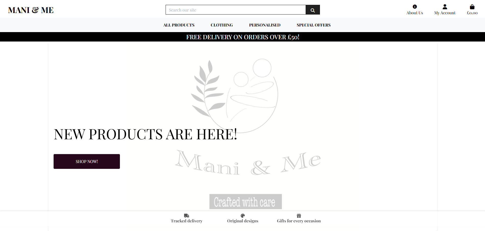

### Navigation:

Navigation

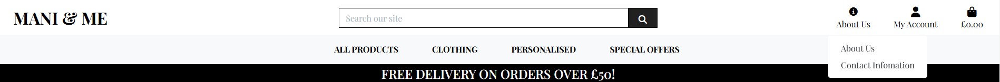
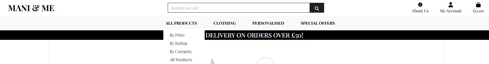

### Product Page:

Product Infomation

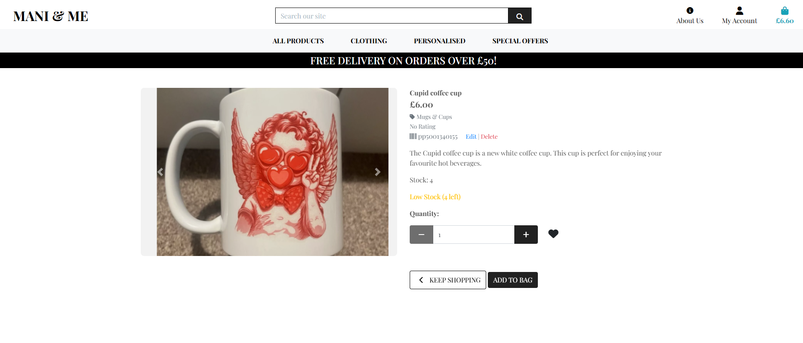

### Checkout Page:

Checkout Bag

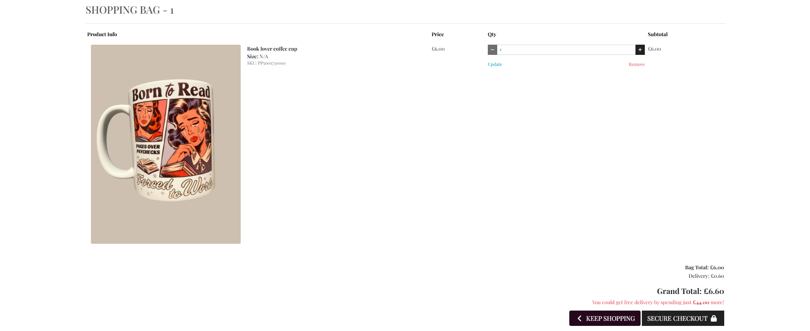

Checkout Order

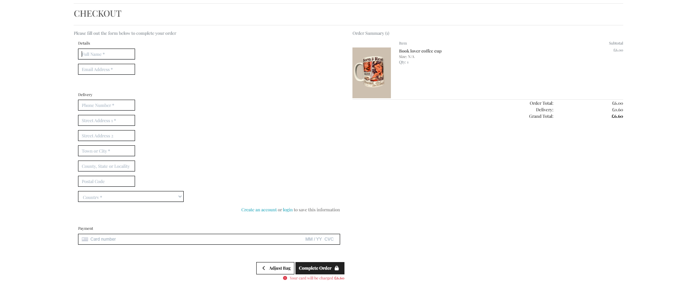

Checkout Sucess

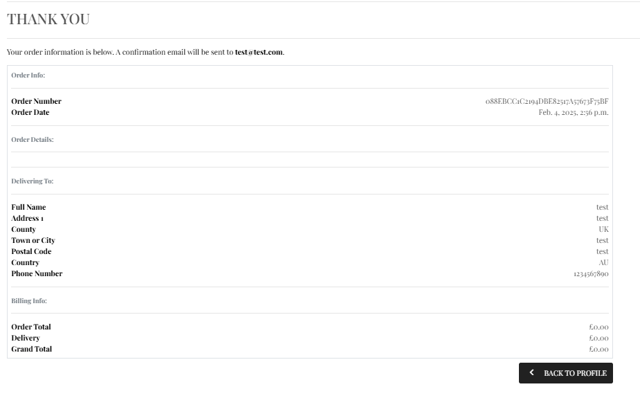

### CRUD Functionality:

Create

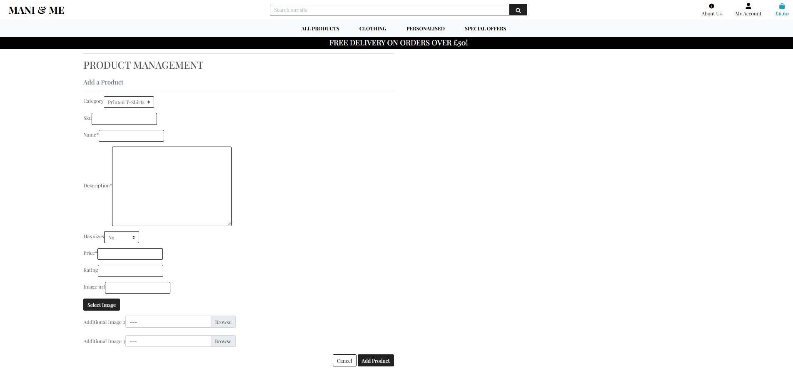

Read

Update

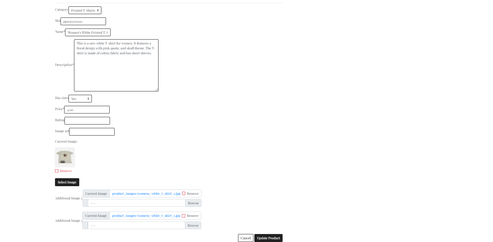

Delete

 
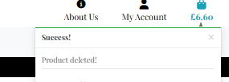

## Accessibility

-

## Testing

### Manual Testing

| What to test        | Expected Results                          | Passed   |
| ------------------- | ----------------------------------------- | -------- |
| Navigation Menu     | Navigate through the site correctly.      | &#x2714; |
| Search for product  | Search function for finding products.     | &#x2714; |
| View prodcucts      | View products in categories.              | &#x2714; |
| Sign Up and Login   | Sign up/Login to site as user/superuser.  | &#x2714; |
| Sorting products    | Sort products by price, rating, category. | &#x2714; |
| Add products        | Superusers to add products to site.       | &#x2714; |
| Delete products     | Superusers to delete products from site.  | &#x2714; |
| Edit products       | Superusers to edit products on site.      | &#x2714; |
| Upload images       | Superusers to add product images.         | &#x2714; |
| Shopping bag - Add  | Users can add products to shopping bag.   | &#x2714; |
| Shopping bag - View | Users can view products in shopping bag.  | &#x2714; |
| Payment             | Allow payments to be made for orders.     | &#x2714; |
| Confirmation        | Web/email confirmation of the order.      | &#x2714; |
| Inventory           | To be able to add stock control.          | &#x2714; |

### For this project I have had friends and family, test amongst various devices. Such as;

-

### Lighthouse - Developer Chrome Tools

Lighthouse Overview

 

Lighthouse Acessibility

 

## Validators

W3c was used to validate HTML, CSS. JShint was used for JavaScript code.

### HTML Validator:

HTML Validator Overview Part 1

 

HTML Validator 

 

### CSS Validator:

 

CSS Validator 

### JavaScript Validator:

JavaScript Validator

## Bugs

### Current Bugs

- Crispy forms seems to not work to the fullest extent. The layout seems to be off, as boxes are in the wrong place or not the full width it suppose to be. Functionality of the forms work as they should.

 
  

  
Console Message

  

### Fixed Bugs

- Sorting and filtering via ascending descending was not consitently working for some categories. In order to fix this, I had to change the if statement to include elif to handle the logic correctly.
- Payment input box was not display due to file path and typo within views.
- Recieved "Bad Request: /checkout/cache_checkout_data/" after debugging my stripe_elements.js, checkout views.py and checkout.html. I found that JSON was not imported within checkout views.py file. After adding this payments and webhooks where successful again.
- Order history was unable to be view when clicked due to no import of the order model.
- Product management form displayed a 'BoundWidget' object has no attribute 'field' error. As I was trying to access the fields directly in the template in an invalid manner. I have removed the field from the form and tried {{ product_form|crispy }} instead.
- When deleting products in the admin view, a page 404 error would display on the site. Making the site unusable, this was due to the products being deleted where still in the session ID.
- Django countries version was newer than the django version I was using, this caused issue in deployment as django countries had some incompatibilities. To over come this, I had to install the LTS version Django. Version 4.2 in particular.
- Favicon 404 error due to not accessing it through .

## Deployments

This project was deployed to GitHub Pages using the steps below;

### How to Deploy to GitHub Pages.

1. Open the browser, search GitHub and log in. If you do not have an account, sign up [here](https://github.com/login).
2. Locate and select the [Mani & Me](https://github.com/Kenya-Rae/mani-and-me).
3. Once the repository is open, select settings.
4. Select 'Pages', which is found on the left-hand side under the Code and Automation category.
5. Underneath build and deployment, there are two sub-heading 'Source' and 'Branch'. Select the 'None' dropdown below the branch sub-heading.
6. Change the 'None' option to 'Main', then press "Save".
7. Wait a few moments whilst the pages refresh. (This could take up to 5 minutes.)
8. You may need to refresh the page, to see the saved changes. You should have seen that the site and the link to the live site. An orange icon will display which will indicate that the save changes are still loading.
9. You can also check your deployment by selecting 'Code'. On the right-hand side, you should see 'Deployments'. Select 'Deployments' to view the status of your deployments.

### How to run this project locally.

To clone this project to Gitpod use the following steps;

1. Open the browser, search GitHub and log in. If you do not have an account, sign up [here](https://github.com/login).
2. Open a new tab, search Gitpod and log in. If you don't have an account, you can sign in with GitHub.
3. Open a new workspace.
4. Go back to the GitHub tab and locate [Mani & Me](https://github.com/Kenya-Rae/mani-and-me).
5. Click the green "<> Code" button.
6. Under the HTTPS tab, copy the URL for the repository.
7. Go back to your Gitpod Workspace and open the terminal.
8. Change the location of your current working directory to where you want the cloned directory.
9. Type "git clone", then paste the URL that you had copied earlier from GitHub.
10. Press Enter to create your local clone.

### How to Fork this project.

To fork this project from Gitpod, please follow the steps below;

1. Open the browser, search GitHub and log in. If you do not have an account, sign up [here](https://github.com/login).
2. Locate the GitHub tab and locate the project you want to fork. [Mani & Me](https://github.com/Kenya-Rae/mani-and-me)
3. At the top right-hand side of the page, you will see a "Fork" button. Click on the button and wait a few moments. You should see the new forked repository under your own GitHub account.
4. By default the folk is named as their upstream repositories, you can rename the repositories by typing a name in the "Repository name" field.
5. You can also add a description to your fork and/or copy the default branch only.
6. To also access the files in the repository. Head over to your forked repository. Click the green "<> Code" button.
7. Under the HTTPS tab, copy the URL for the repository.
8. Go to the workspace you have created earlier.
9. To change the current directory to the location where you want the cloned directory.
10. Type "git clone" and paste the URL you copied from GitHub. Press "Enter" and your local clone will be created.

### How to Deploy to Heroku.

To deploy to Heroku, follow the steps below;

1. Within your project coding environment. Open the terminal and generate a requirements file via typing " pip freeze --local > requirements.txt "
2. In the root directory create a file called Procfile, ensure that a capital "P" is used to ensure Heroku reads this. Then within this file add " web: python run.py.
3. Use a database or object storage instead of writing to your local filesystem.
4. In Heroku, create a new app.
5. Add a app name. Complete language-specific setup.
6. Select "Create App".
7. Explore the Heroku platform.
8. Within the settings, click "Reveal Config Vars". Use the variable within the env.py. Ensure that DEBUG, DEVELOPMENT and DB_URL is not included. As well as no strings in qoutes when adding the values.
9. Locate to the Deploy tab and navigate towards the "Deployment method" section, select “Connect to GitHub”.
10. Search for your repository and click Connect.
11. You can click "Enable Automatic Deploys" in case of any further changes to the project. This will push over when you make the push to GitHub.
12. If you are using the Manual deploy section and click Deploy Branch. This will start the build process.
      <strong>Note: If any changes are made to models you will need to manually make the migrations within Heroku.</strong>
13. The app should running now, click the “Open app” button.
      <strong>Note: The deployed app will load, but as the new database is empty you will need to add in some data.</strong>

## Credits

### Frameworks, Libraries and Programs Used

- [Balsamiq](https://balsamiq.com/) - For creating wireframes.
- [GitHub](https://github.com/) - To store my repository and deploy site.
- [Gitpod](https://www.gitpod.io/) - Used to write code for this project.
- [Heroku](https://www.heroku.com/) - To deploy my application.
- [Django](https://www.djangoproject.com/) - For developing this web application.
- [EmailJs](https://www.emailjs.com/docs/) - Used in my forgot password route/function.
- [HTML Validation](https://validator.w3.org/) - To validate my HTML Code.
- [CSS Validation](https://jigsaw.w3.org/css-validator/) - To validate my CSS code.
- [JS Validation](https://jshint.com/) - To validate my script.
- [AWS](https://aws.amazon.com/) - To store my static and media files.
- [Favicon](https://favicon.io/) - To make an icon for the browser tab.
- [Google Fonts](https://fonts.google.com/) - Provided the font style for the site.
- [Font Awesome](https://fontawesome.com/) - For icons in the site.
- [Coolors](https://coolors.co/) - Randomly generate colours.

### Code

- [Boutque Ado](https://learn.codeinstitute.net/courses/course-v1:CodeInstitute+FSF_102+4/courseware/4201818c00aa4ba3a0dae243725f6e32/d3188bf68530497aa5fba55d07a9d7d7/) - Where comments are added this is where I had gotten it from. Made changes to most sections that were used from this walkthrough.
- [Go Back W3schools](https://www.w3schools.com/jsref/met_his_back.asp) - Just for the go back function.

### Acknowledgments

- Friends and Family that tested and supported through my final project. Aswell the entirety of the course
- Tutor support for helping me during deployment and migration as there were some bugs that I wasnt able to fix.
- Slack community as they had helped me during my migrating progess. As well as this, reading through similar issue/bugs that I faced in the project.

[Back to top](#title)
